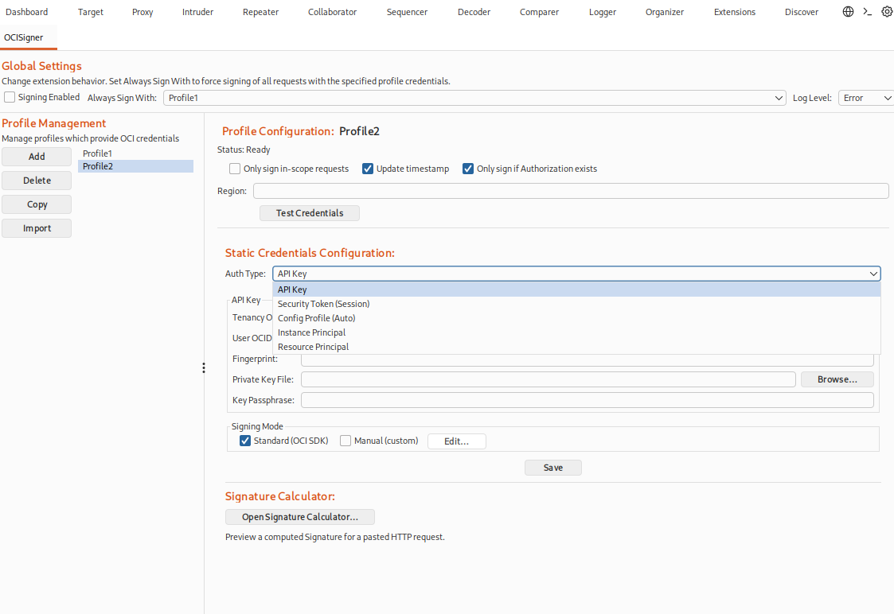
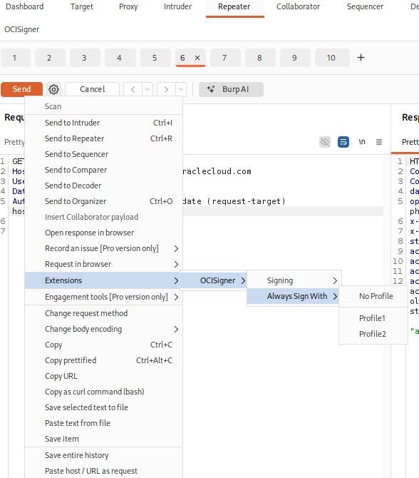

# OCISigner


## Overview

> In the spirit of full transparency, development of this extension was assisted by LLM coding assistants. The assistant did most of the heavy lifting. As with any open-source tool, review the code to understand what it does before running it. That said, the code has been reviewed for potential issues.

OCISigner is a Burp Suite extension for signing OCI HTTP requests using API Key, Session Token, Config Profile (auto), Instance Principal (X.509), and Resource Principal (RPST) authentication methods. It supports SDK signing where possible and manual signing where the SDK is too restrictive for different use cases (ex. manually adding more headers to sign).

## In-Depth Documentation
Review the GitHub wiki for an in-depth review of each authentication mechanism, all the features supported by the plugin, and different authentication notes:
- https://github.com/NetSPI/OCISigner/wiki

## Installation TLDR

Requirements:
- Burp Suite (Montoya API compatible)
- Java 21+ for local builds (default minimum target is Java 21)
- Release artifacts may include up to JDK 25 builds; use a lower-target jar (for example JDK 21) if your Burp runtime is older.

### Option 1: Install from GitHub Releases
1. Download the latest release jar matching your runtime from:
   - https://github.com/NetSPI/OCISigner/releases
   - Example: use `*-jdk25.jar` if Burp runs on Java 25; use `*-jdk21.jar` if Burp runs on Java 21.
2. In Burp Suite, go to `Extensions` -> `Installed` -> `Add`.
3. Set `Extension type` to `Java` and select the downloaded jar.

### Option 2: Build and install locally
1. Build the extension:
   - `mvn clean package`
2. In Burp Suite, go to `Extensions` -> `Installed` -> `Add`.
3. Set `Extension type` to `Java` and select `target/OCISigner-*-all.jar`.

## Quick Start
> [!NOTE]
> For most credentials (with the exception of **Instance Principal**), **Test Credentials** validates by sending a signed probe request to the namespace endpoint.
> This is an Object Storage **GetNamespace** (`/n/`) request sent to the supplied region to confirm credential/signing behavior.
> Per OCI documentation [here](https://docs.oracle.com/en-us/iaas/Content/Identity/policyreference/objectstoragepolicyreference.htm), **GetNamespace does not require authorization**, which makes it a good endpoint to validate credential handling regardless of granted permissions. See the wiki for the correspnding screenshot of documentation.

1. In the OCISigner tab, pick an auth method, fill inputs, click **Save**.
2. Optionally click **Test Credentials** to validate.
3. Set **Always Sign With** to your profile and send requests in Repeater/Proxy.

## Important features TLDR

1. Toggle "Only sign in-scope requests" to only sign destinations set as in-scope in your Target tab
2. Toggle "Update timestamp" to automatically update the timestsamp for any date or x-date headers
3. Toggle "Only sign if Authorization exists" to only sign incoming HTTP requests that have an Authorization header. Helpful if you don't want ot sign requests going to other hosts that don't already have OCI auth.
4. "Test Credentials" will send a GetNamespace (/n/) API request to the region supplied to validate the creds supplied are valid.
     - **Note**: The Instance Profile authentication method is a bit of an exception. It will instead call /v1/x509 to generate a session token for future requests. See [wiki instructions](https://github.com/NetSPI/OCISigner/wiki) for futher details on proxying this x509 request to view the traffic in the Logger tab. 

## Screenshots

<p align="center" style="margin: 0.35em 0 0 0;">
  
</p>
<p align="center" style="margin: 0.15em 0 1em 0;"><em>Figure 1. OCISigner Burp Suite Tab.</em></p>

<p align="center" style="margin: 0.35em 0 0 0;">
  
</p>
<p align="center" style="margin: 0.15em 0 1em 0;"><em>Figure 2. OCISigner Tab in Extensions Menu Item.</em></p>

## Dependency Inventory

| Dependency | Where Used | Purpose |
|---|---|---|
| `net.portswigger.burp.extensions:montoya-api:2026.2` | Burp extension entrypoint + UI panels + request hooks | Burp Suite extension API (UI, request handling, proxy integration). |
| `org.bouncycastle:bcprov-jdk18on:1.83` | Key parsing + crypto primitives | PEM and RSA key handling for signing. |
| `org.bouncycastle:bcpkix-jdk18on:1.83` | X.509 handling | Certificate parsing and chain handling for instance principal federation. |
| `com.oracle.oci.sdk:oci-java-sdk-shaded-full:3.81.0` | SDK signing mode + config profile provider | Uses OCI SDK signing where feasible and reads OCI config profiles. |
| `com.fasterxml.jackson.core:jackson-databind:2.21.1` | Token parsing + JWT helpers | JSON parsing for token responses and JWT claim extraction. |
| `org.junit.jupiter:junit-jupiter:6.0.3`* | Unit tests only | JUnit 5 test framework (unit tests and assertions). |
| `org.slf4j:slf4j-simple:2.0.17`* | Unit tests only | SLF4J binding to show logs during tests. |

*Test-scoped dependency.

### Bundled/transitive dependencies (via OCI SDK shaded full)
The shaded OCI SDK embeds a large set of transitive libraries, including Jackson, Jersey, Apache HTTP Client, HK2, Jakarta/Javax APIs, SLF4J, commons-logging, and commons-codec.

## Notes on Shading
The build relocates:
```
com.oracle.bmc -> com.webbinroot.ocisigner.shadow.com.oracle.bmc
```
This avoids classloader conflicts with other Burp extensions.
